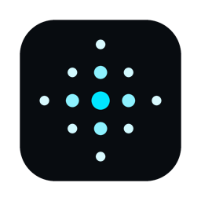
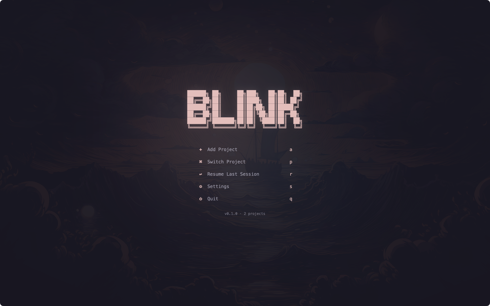

<p align="center">
  
</p>

<h1 align="center">Blink</h1>

<p align="center">
  A native macOS terminal workspace for developers with column-based layout, tmux-backed persistence, fast workspace switching, CLI AI sessions, and an isolated workspace browser
</p>

<p align="center">
  Built on <a href="https://github.com/ghostty-org/ghostty">libghostty</a> for GPU-accelerated terminal rendering and <a href="https://github.com/YaLTeR/niri">Niri</a>-style tiling layout
</p>

<p align="center">
  <a href="#features">Features</a> •
  <a href="#install">Install</a> •
  <a href="#keybindings">Keybindings</a> •
  <a href="#development">Development</a> •
  <a href="#workspace-structure">Workspace Structure</a> •
  <a href="#license">License</a>
</p>

---

<p align="center">
  
</p>

## Features

### Terminal

- **libghostty engine** — GPU-accelerated rendering via Metal, the same core that powers [Ghostty](https://ghostty.org)
- **tmux-backed shell persistence** — workspace shells and editors can be reattached instead of restarted
- **Managed tool panes** — open dedicated tabs for Neovim, lazygit, Yazi, Spotify, and other workspace commands inside the workspace
- **Drag-and-drop file support** — drop files onto the terminal to paste their path
- **MesloLGS Nerd Font** — bundled with full icon/glyph support out of the box

### Window Management

- **Niri-style vertical columns** — each tab opens in a scrollable column layout, not a fixed grid
- **Absorb and expel panes** — pull a neighboring column's tab into your column, or push one out
- **Overview mode** — zoom out to see all columns and panes at once
- **Resizable columns** — cycle through width presets with `⌘]` / `⌘[`

### Workspace Management

- **Scratch Space and folder-based workspaces** — jump into a general workspace or add any folder as a workspace
- **Per-workspace restore** — Blink remembers your tab/column layout and reconnects shell panes on relaunch
- **Sidebar with git branch tracking** — see the active branch for each workspace at a glance
- **Shell-first tooling** — run `nvim`, `lazygit`, `yazi`, `spotify`, or any other CLI in workspace-scoped tabs without extra wrappers
- **CLI AI sessions** — launch Claude Code, Codex, or OpenCode in tracked workspace panes

### Workspace Browser

- **Isolated workspace browser panes** — open web pages inside the current workspace without turning Blink into a full personal browser
- **Workspace-scoped Chromium profiles** — cookies and storage stay scoped to the active workspace browser context
- **Browser panes live in the same layout model** — browser and terminal panes share the same columns, focus model, and tab workflow
- **Built for dev flows first** — localhost previews, docs, auth redirects, downloads, and DevTools are in scope; sync/import/general browsing are not

### Appearance

- **Theme presets** — switch themes on the fly with a picker overlay
- **Wallpapers with opacity and blur** — set a background image behind your terminal
- **Dark mode by default** — designed for dark environments

## Install

### Homebrew (recommended)

```sh
brew install --cask bradjenn/tap/blink
```

### Manual Download

[Download the latest DMG](https://github.com/bradjenn/blink/releases/latest)

> Blink is not yet notarized. After installing manually, run:
> ```
> xattr -d com.apple.quarantine /Applications/Blink.app
> ```
> Or right-click the app and select **Open** on first launch.

Requires macOS Sonoma+ and Apple Silicon (M1 or later).

Persistent shell/editor reattachment and in-app Neovim reuse work best with `tmux`, and Blink Neovim integration assumes `nvim` is installed.

The browser in Blink is an isolated workspace browser, not a full general-purpose browser replacement.

## Keybindings

All shortcuts use `Cmd` (`⌘`) as the modifier.

| Shortcut | Action |
| --- | --- |
| `⌘T` | New window |
| `⌘W` | Close window |
| `⌘H` | Focus left column |
| `⌘L` | Focus right column |
| `⌘J` | Focus down pane |
| `⌘K` | Focus up pane |
| `⇧⌘H` | Move column left |
| `⇧⌘L` | Move column right |
| `⇧⌘J` | Absorb from left |
| `⇧⌘K` | Absorb from right |
| `⇧⌘E` | Expel pane |
| `⌘O` | Overview |
| `⌘B` | Toggle sidebar |
| `⌥⌘B` | Open workspace browser |
| `⌥⌘L` | Focus workspace browser address bar |
| `⌘G` | Open lazygit |
| `⇧⌘A` | Open AI session |
| `⌘P` | Workspace switcher |
| `⇧⌘T` | Theme picker |
| `⌘,` | Settings |
| `⌘1`–`⌘9` | Jump to window N |

## Development

### Tech Stack

| Layer | Technology |
| --- | --- |
| UI Framework | SwiftUI |
| Terminal Rendering | Metal via libghostty (GhosttyKit) |
| Shell Persistence | tmux |
| Window Chrome | AppKit (NSWindow, NSMenu) |
| Workspace Config | XcodeGen (`workspace.yml`) |
| Testing | XCTest |

### Prerequisites

- macOS 14 Sonoma or later
- Xcode 16+
- Apple Silicon Mac (M1 or later)
- `GhosttyKit.xcframework` in `Frameworks/`
- `tmux` for persistent shell/editor sessions
- `nvim` for Blink's in-app editor flow

### Getting Started

```sh
git clone https://github.com/bradjenn/blink.git
cd blink
open Blink.xcodeproj
```

Build and run from Xcode (`⌘R`), or create a release DMG:

```sh
./scripts/build-dmg.sh
```

## Workspace Structure

```
Blink/
├── BApp.swift                  # App entry point, menu commands, keybindings
├── Assets.xcassets/            # App icon, colors, images
├── Resources/                  # Bundled fonts, themes, wallpapers
├── Models/
│   ├── Column.swift            # Column layout model
│   ├── Workspace.swift           # Workspace definition
│   ├── Tab.swift               # Tab state
│   └── WallpaperPreset.swift   # Wallpaper configuration
├── Store/
│   ├── AppStore.swift          # Central app state, tmux integration, tab/editor actions
│   └── GitStatus.swift         # Git branch monitoring
├── Terminal/
│   ├── GhosttyApp.swift        # libghostty lifecycle and config
│   ├── SurfaceManager.swift    # Terminal surface allocation
│   ├── TerminalSurfaceView.swift # Metal-backed terminal view
│   ├── TerminalTheme.swift     # Terminal color schemes
│   └── TerminalView.swift      # Terminal container with chrome
├── Theme/
│   ├── Theme.swift             # Theme protocol
│   ├── ThemeManager.swift      # Theme loading and switching
│   └── Color+Hex.swift         # Hex color parsing
├── Views/
│   ├── Shell.swift             # Main workspace layout (columns, tabs, overview)
│   ├── Sidebar.swift           # Workspace sidebar
│   ├── TabBar.swift            # Tab strip
│   ├── StatusLine.swift        # Bottom status bar
│   ├── ThemePicker.swift       # Theme selection overlay
│   ├── SettingsPage.swift      # Settings panel
│   ├── StartScreen.swift       # Welcome / workspace picker
│   └── Settings/               # Settings sub-pages
├── Utilities/
│   ├── Constants.swift         # Layout constants, defaults
│   └── WindowTitleBarConfigurator.swift
├── Frameworks/
│   └── GhosttyKit.xcframework # Pre-built libghostty binary
├── BTests/                     # Unit tests
├── scripts/                    # Build and packaging scripts
└── workspace.yml                 # XcodeGen workspace definition
```

## License

[MIT](LICENSE)

---

<p align="center">
  <a href="https://github.com/bradjenn/blink/issues/new?template=bug_report.md">Report Bug</a> •
  <a href="https://github.com/bradjenn/blink/issues/new?template=feature_request.md">Request Feature</a>
</p>
